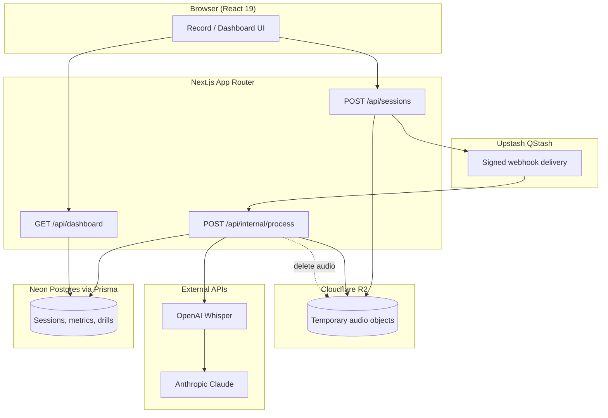
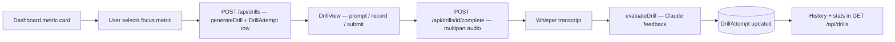

# System diagrams

Mermaid diagrams for the Learning Speaking App. They match the App Router structure under `src/app`, the pipeline in `src/lib/pipeline`, and auth in `src/features/auth`.

## End-to-end data flow (recording → dashboard)



## Authentication flow (OIDC + session cookie)

```mermaid
sequenceDiagram
  participant U as User
  participant B as Browser
  participant A as Next.js app
  participant I as Auth server (OIDC)

  U->>B: Sign in
  B->>A: Start Auth.js sign-in
  A->>I: OIDC authorize (PKCE)
  I->>B: Redirect with authorization code
  B->>A: Callback route exchanges code
  A->>B: Set session cookie (JWT)
  Note over B,A: Subsequent API calls send cookie; middleware validates access to /app routes

  U->>B: Federated sign-out
  B->>A: GET /api/auth/federated-signout
  A->>B: Clear Auth.js cookies, redirect to IdP logout
  I->>B: Logout complete → APP_URL
```

## Drill training flow


